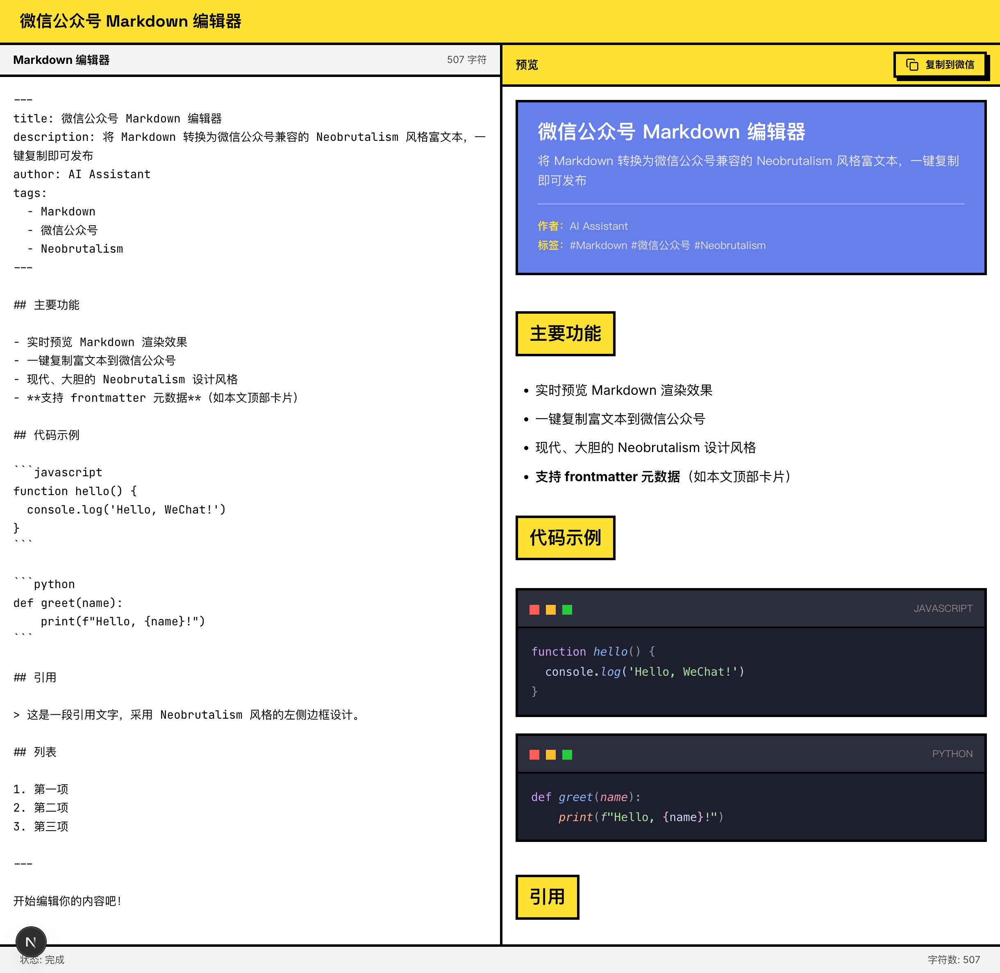

# Markdown to WeChat Editor

将 Markdown 文章自动转换为微信公众号富文本内容的在线编辑器。

## 预览



## 功能特性

- 实时编辑 - 左侧 Markdown 编辑器，支持语法高亮
- 即时预览 - 右侧实时渲染为微信公众号样式
- 一键复制 - 直接复制富文本内容到微信公众号后台发布
- Neobrutalism 风格 - 独特的视觉设计，粗边框、高对比度、扁平化
- 响应式设计 - 支持桌面端和移动端访问

## 技术栈

- [Next.js 16](https://nextjs.org/) - React 全栈框架
- [TypeScript](https://www.typescriptlang.org/) - 类型安全的 JavaScript
- [Tailwind CSS](https://tailwindcss.com/) - 实用优先的 CSS 框架
- [shadcn/ui](https://ui.shadcn.com/) - 高质量 React 组件库

## 快速开始

### 环境要求

- Node.js 18.17 或更高版本
- npm 或 yarn 或 pnpm

### 安装

```bash
# 克隆项目
git clone <repository-url>
cd md-template

# 安装依赖
npm install
```

### 开发

```bash
# 启动开发服务器
npm run dev

# 访问 http://localhost:3000
```

### 构建

```bash
# 构建生产版本
npm run build

# 启动生产服务器
npm start
```

## 项目结构

```
md-template/
├── src/
│   ├── app/          # Next.js App Router 页面
│   ├── components/   # React 组件
│   ├── lib/          # 工具函数和配置
│   └── styles/       # 全局样式
├── public/           # 静态资源
├── specs/            # 项目规格文档
├── .gitignore        # Git 忽略配置
├── package.json      # 项目依赖
├── tsconfig.json     # TypeScript 配置
├── tailwind.config.ts # Tailwind CSS 配置
└── README.md         # 项目说明
```

## 使用说明

1. 在左侧编辑器输入 Markdown 内容
2. 右侧实时预览微信公众号样式效果
3. 点击复制按钮，将富文本内容复制到剪贴板
4. 打开微信公众号后台，粘贴内容即可发布

## 支持的 Markdown 语法

- 标题 (H1-H6)
- 段落和换行
- 粗体和斜体
- 列表 (有序/无序)
- 引用块
- 代码块和行内代码
- 链接和图片
- 表格
- 分隔线

## 开发计划

- [ ] 支持自定义主题配色
- [ ] 支持导出为 HTML/PDF
- [ ] 支持图片上传和管理
- [ ] 支持文章草稿保存
- [ ] 支持多种预设样式模板

## 贡献

欢迎提交 Issue 和 Pull Request。

## License

MIT © [wxvirus](https://github.com/sword-demon/md-template)
